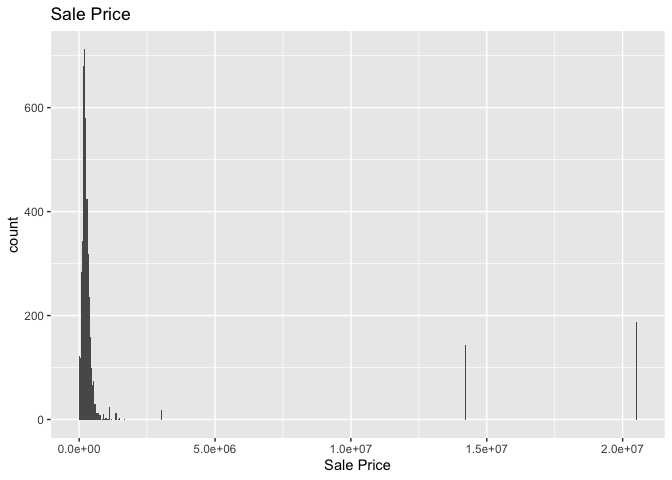
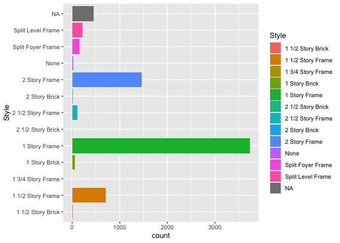
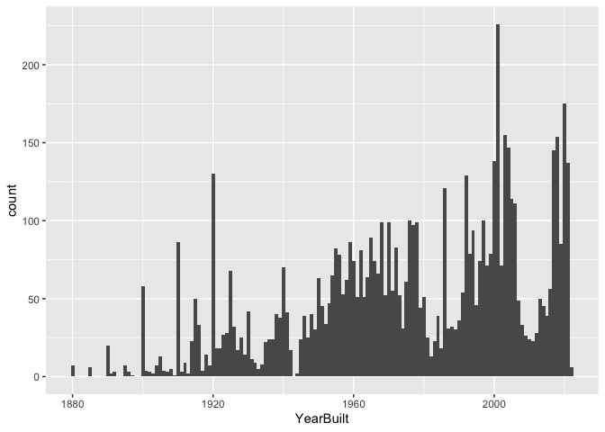

<!-- README.md is generated from README.Rmd. Please edit the README.Rmd file -->

# Lab report \#1

Follow the instructions posted at
<https://ds202-at-isu.github.io/labs.html> for the lab assignment. The
work is meant to be finished during the lab time, but you have time
until Monday evening to polish things.

Include your answers in this document (Rmd file). Make sure that it
knits properly (into the md file). Upload both the Rmd and the md file
to your repository.

All submissions to the github repo will be automatically uploaded for
grading once the due date is passed. Submit a link to your repository on
Canvas (only one submission per team) to signal to the instructors that
you are done with your submission.

# Step 1: Inspect the first few lines of the data set:

**What variables are there?**

``` r
names(ames)
```

    ##  [1] "Parcel ID"             "Address"               "Style"                
    ##  [4] "Occupancy"             "Sale Date"             "Sale Price"           
    ##  [7] "Multi Sale"            "YearBuilt"             "Acres"                
    ## [10] "TotalLivingArea (sf)"  "Bedrooms"              "FinishedBsmtArea (sf)"
    ## [13] "LotArea(sf)"           "AC"                    "FirePlace"            
    ## [16] "Neighborhood"

**Of what type are the variables?**

``` r
sapply(ames, class)
```

    ##             Parcel ID               Address                 Style 
    ##           "character"           "character"              "factor" 
    ##             Occupancy             Sale Date            Sale Price 
    ##              "factor"                "Date"             "numeric" 
    ##            Multi Sale             YearBuilt                 Acres 
    ##           "character"             "numeric"             "numeric" 
    ##  TotalLivingArea (sf)              Bedrooms FinishedBsmtArea (sf) 
    ##             "numeric"             "numeric"             "numeric" 
    ##           LotArea(sf)                    AC             FirePlace 
    ##             "numeric"           "character"           "character" 
    ##          Neighborhood 
    ##              "factor"

**What does each variable mean?**

*Address = the adress of the house, Style = the type of building,
Occupancy = how many people live in the place, Sale Date = the date of
the sale of the place, Sale Price = how much the place sold for, Multi
Sale = yes or no question, Year Built = The year the place had been
built, Acres = how many acres the property is, Total Living Area = the
square footage of the property, Bedrooms = amount of bedrooms in the
property, Finished Basement Area = how much squarefootage of finished
basement in the property, Lot area = square footage of the lot, AC = yes
or no if the property has AC, Fireplace = yes or no if the property has
a fireplace, Neighborhood = What place of Ames the property is located.*

**What do we expect their data range to be?**

``` r
ames[ames == 0] <- NA
summary(ames)
```

    ##   Parcel ID           Address                        Style     
    ##  Length:6935        Length:6935        1 Story Frame    :3732  
    ##  Class :character   Class :character   2 Story Frame    :1456  
    ##  Mode  :character   Mode  :character   1 1/2 Story Frame: 711  
    ##                                        Split Level Frame: 215  
    ##                                        Split Foyer Frame: 156  
    ##                                        (Other)          : 218  
    ##                                        NA's             : 447  
    ##                           Occupancy      Sale Date            Sale Price      
    ##  Condominium                   : 711   Min.   :2017-07-03   Min.   :       1  
    ##  Single-Family / Owner Occupied:4711   1st Qu.:2019-03-27   1st Qu.:  165500  
    ##  Townhouse                     : 745   Median :2020-09-22   Median :  232000  
    ##  Two-Family Conversion         : 139   Mean   :2020-06-14   Mean   : 1492116  
    ##  Two-Family Duplex             : 182   3rd Qu.:2021-10-14   3rd Qu.:  344000  
    ##  NA's                          : 447   Max.   :2022-08-31   Max.   :20500000  
    ##                                                             NA's   :2206      
    ##   Multi Sale          YearBuilt        Acres         TotalLivingArea (sf)
    ##  Length:6935        Min.   :1880   Min.   : 0.0010   Min.   :   3        
    ##  Class :character   1st Qu.:1956   1st Qu.: 0.1510   1st Qu.:1122        
    ##  Mode  :character   Median :1978   Median : 0.2200   Median :1474        
    ##                     Mean   :1976   Mean   : 0.2633   Mean   :1540        
    ##                     3rd Qu.:2002   3rd Qu.: 0.2780   3rd Qu.:1800        
    ##                     Max.   :2022   Max.   :12.0120   Max.   :6007        
    ##                     NA's   :448    NA's   :95        NA's   :588         
    ##     Bedrooms      FinishedBsmtArea (sf)  LotArea(sf)          AC           
    ##  Min.   : 1.000   Min.   :  10.0        Min.   :    63   Length:6935       
    ##  1st Qu.: 3.000   1st Qu.: 474.0        1st Qu.:  6583   Class :character  
    ##  Median : 3.000   Median : 727.0        Median :  9584   Mode  :character  
    ##  Mean   : 3.319   Mean   : 776.7        Mean   : 11476                     
    ##  3rd Qu.: 4.000   3rd Qu.:1011.0        3rd Qu.: 12088                     
    ##  Max.   :10.000   Max.   :6496.0        Max.   :523228                     
    ##  NA's   :486      NA's   :2682          NA's   :95                         
    ##   FirePlace                            Neighborhood 
    ##  Length:6935        (27) Res: N Ames         : 854  
    ##  Class :character   (37) Res: College Creek  : 652  
    ##  Mode  :character   (57) Res: Investor Owned : 474  
    ##                     (29) Res: Old Town       : 469  
    ##                     (34) Res: Edwards        : 444  
    ##                     (19) Res: North Ridge Hei: 420  
    ##                     (Other)                  :3622

# Step 2

**Is there a variable of special interest or focus?**

*Sale Price is the variable of interest*

# Step 3

**Start the exploration with the main variable**

``` r
ggplot(ames, aes(x = `Sale Price`)) + 
  geom_histogram(bins = 500) +
  ggtitle("Sale Price")
```

    ## Warning: Removed 2206 rows containing non-finite values (`stat_bin()`).

<!-- -->

**What is the range of the variable?**

*Range = 20500000*

**What is the general pattern?**

*The graph is right-skewed with extreme outliers*

**Is there anything odd?**

*Other than the outliers no*

# Step 4, Individual

``` r
## 4) Range = 13870
library(ggplot2)
ggplot(data = ames, aes(x = Style, fill = Style)) +
  geom_bar() +
  coord_flip()
```

<!-- -->

``` r
  labs(title = "Bar Chart of Style",
       x = "Style",
       y = "Count")
```

    ## $x
    ## [1] "Style"
    ## 
    ## $y
    ## [1] "Count"
    ## 
    ## $title
    ## [1] "Bar Chart of Style"
    ## 
    ## attr(,"class")
    ## [1] "labels"

``` r
ggplot(ames, aes(x = Bedrooms)) + geom_histogram(binwidth = 1)
```

    ## Warning: Removed 486 rows containing non-finite values (`stat_bin()`).

<!-- -->
