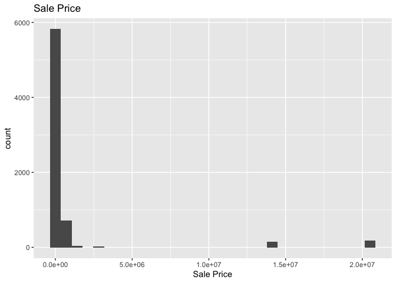

<!-- README.md is generated from README.Rmd. Please edit the README.Rmd file -->

# Lab report \#1

Follow the instructions posted at
<https://ds202-at-isu.github.io/labs.html> for the lab assignment. The
work is meant to be finished during the lab time, but you have time
until Monday evening to polish things.

Include your answers in this document (Rmd file). Make sure that it
knits properly (into the md file). Upload both the Rmd and the md file
to your repository.

All submissions to the github repo will be automatically uploaded for
grading once the due date is passed. Submit a link to your repository on
Canvas (only one submission per team) to signal to the instructors that
you are done with your submission.

*Step 1: Inspect the first few lines of the data set:*

*what variables are there?*

``` r
names(ames)
```

    ##  [1] "Parcel ID"             "Address"               "Style"                
    ##  [4] "Occupancy"             "Sale Date"             "Sale Price"           
    ##  [7] "Multi Sale"            "YearBuilt"             "Acres"                
    ## [10] "TotalLivingArea (sf)"  "Bedrooms"              "FinishedBsmtArea (sf)"
    ## [13] "LotArea(sf)"           "AC"                    "FirePlace"            
    ## [16] "Neighborhood"

``` r
## 2) is there a variable of special interest or focus?

## Sale Price is the variable of special interest.
```

``` r
## 3)
ggplot(ames, aes(x = 6)) + 
  geom_histogram(binwidth = 1) +
  ggtitle("Sale Price")
```

<!-- -->

``` r
## 4) Range = 20500000
library(ggplot2)
ggplot(data = ames, aes(x = Style, fill = Style)) +
  geom_bar() +
  coord_flip()
```

<!-- -->

``` r
  labs(title = "Bar Chart of Sale Price by Style",
       x = "Style",
       y = "Sale Price")
```

    ## $x
    ## [1] "Style"
    ## 
    ## $y
    ## [1] "Sale Price"
    ## 
    ## $title
    ## [1] "Bar Chart of Sale Price by Style"
    ## 
    ## attr(,"class")
    ## [1] "labels"

*Of what type are the variables?*

``` r
sapply(ames, class)
```

    ##             Parcel ID               Address                 Style 
    ##           "character"           "character"              "factor" 
    ##             Occupancy             Sale Date            Sale Price 
    ##              "factor"                "Date"             "numeric" 
    ##            Multi Sale             YearBuilt                 Acres 
    ##           "character"             "numeric"             "numeric" 
    ##  TotalLivingArea (sf)              Bedrooms FinishedBsmtArea (sf) 
    ##             "numeric"             "numeric"             "numeric" 
    ##           LotArea(sf)                    AC             FirePlace 
    ##             "numeric"           "character"           "character" 
    ##          Neighborhood 
    ##              "factor"

*What does each variable mean?*

what do we expect their data range to be?

Simply running the summary of the data set gives up all the column names
and what
